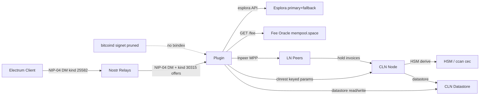

# Trust Boundary Map

Mermaid diagram + per-boundary table for the nostr-subswap-provider stack.
Grounded in: security-analysis-2026-08-30.md, AGENTS.md, plugin source.

## Architecture Diagram

## Boundary Table

| Boundary | What crosses | Authentication (verify vs trust) | Known attacks | SPOF |
|---|---|---|---|---|
| **Electrum client <-> Nostr relays** | kind 25582 NIP-04 encrypted DMs (swap params, invoices, pubkeys) | NIP-04 shared-secret encryption; pubkey in DM verified against offer pubkey. We VERIFY ciphertext decrypts with expected key. We TRUST relay delivery/timing. | Relay censorship; DM plaintext visible to relay operator; timing correlation. Not in security-analysis. | Relay availability (mitigated: multi-relay). |
| **Nostr relays <-> Plugin** | kind 30315 offers (+PoW anti-spam); kind 25582 DMs; kind 30315 offer publication | Offer signature verified (NIP-01). PoW difficulty checked. DM decrypts with our seckey. We VERIFY cryptographic signatures. We TRUST relay is not withholding DMs. | Relay sees ciphertext + timing (third-party leak). Offer replay via different relay. | Relay set — if all relays collude or go down, no swaps. |
| **Plugin <-> CLN node (clnrest)** | `holdinvoice`, `cancelholdinvoice`, `listinvoices`, `listdatastore`, `datastore`, `pay`, `keysend`; all via HTTP REST | clnrest RBAC token (file on localhost). TLS to clnrest socket. We VERIFY HTTP response codes + JSON schema. We TRUST clnrest correctly implements CLN RPC. | #9452 dust-shortfall crash (upstream CLN bug, fixed in our fork). RPC parameter naming (`amount=` not `amount_msat=`). | clnrest process; CLN node crash takes plugin down. |
| **Plugin <-> Datastore** | Swap state (SwapData JSON), tombstones (#25), hold-invoice store (#8 type-guard) | CLN datastore auth (same clnrest RBAC). JSON round-trip validated: non-HoldInvoice entries skipped and purged (#8). We VERIFY type on load. We TRUST datastore durability. | #10 batch theft: single `listdatastore` RPC extracts all plaintext secrets from old-format swaps. #13 plaintext secrets on disk. | Datastore corruption = all swap state lost. Old-format swaps have plaintext privkey/preimage on disk until expiry. |
| **Plugin <-> Chain sources** | Tx lookup (esplora primary + Blockstream signet fallback); fee estimates (mempool.space oracle, O4) | HTTPS TLS to esplora. Response JSON validated (tx hex, confirmations). Fee oracle: range-checked (out-of-range = broken = fail-open per O4). We VERIFY tx structure. We TRUST esplora returns correct chain data. | Esplora returns stale/wrong tx. Fee oracle learns claim-timing pattern (O4 accepted tradeoff). bitcoind pruned no-txindex on inr2 — `getrawtransaction` fails for confirmed txs. | Esplora downtime. Fee oracle timeout (5s) falls through to FALLBACK_FEE_SATVB. |
| **Plugin <-> LN Peers** | Hold invoices (d1: main + prepay via `bundle_payments` R4); MPP HTLC sets; `invoices_to_pay` parked payments; route hints (R9 public channels) | BOLT #11 invoice signature verified. Payment_hash checked fresh (R6). MPP sum verified complete before settle (R7). Hold-invoice CLTV gates HTLC lifetime. We VERIFY all BOLT-level invariants. We TRUST peer forwards HTLCs. | #12 liquidity jam (d1 fixed by prepay R4; d2 still open). HTLC cancellation race window (hold-invoice-analysis: between park and irrevocable commitment). R5: orphaned HTLCs on unknown hash. | Peer connectivity for invoice payment. Channel capacity for outbound payments. |
| **CLN node <-> HSM** | Derived claim keys + preimages for new-format swaps (#36 HSM split) | HSM derivation via `signmessage` / `derivesecret`. Secrets never leave HSM boundary. We VERIFY derivation output. We TRUST HSM is the sole custodian. | #13: if HSM is compromised, all derived secrets exposed. Old-format swaps have plaintext secrets that bypass HSM. | HSM process — crash loses ability to derive but not to settle already-derived swaps. |

## Secrets Flow Summary

- **New-format swaps (#36):** claim keys + preimages derived from CLN's HSM. Never touch disk. Derived on-demand at swap creation, re-derived for claim.
- **Old-format swaps:** `privkey`/`preimage` stored as HEX in SwapData in the datastore (gotcha #2: AGENTS.md). Bounded by locktime — they persist until the swap expires.
- **Preimages (d2):** we generate `os.urandom(32)`, compute `sha256(preimage) = payment_hash`. In new-format, preimage is HSM-derived; in old-format, stored plaintext.

## Third-Party Leak Surfaces

1. **Nostr relays** see DM ciphertext + timing (content hidden by NIP-04, but pattern analysis possible).
2. **Fee oracle** (mempool.space / mutinynet.com) learns claim-timing pattern — O4 accepted tradeoff; self-host with `FEE_ORACLE_URL` to avoid.
3. **Esplora endpoints** see our tx-lookup pattern (which lockup addresses we watch).